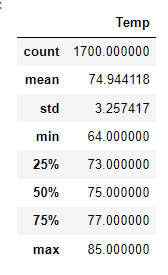
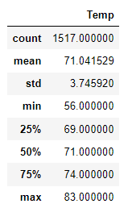

# Surfs Up
## Overview of Analysis

### In this analysis we will look at data from weather stations Oahu. We will use that data to determine if the location is a suitable site to open a surf & ice cream shop.

## Weather Analysis Results

### To deterimine whether Oahu would be a good place to open a Surf & Ice Cream business we looked at weather data for the region from June and December. This was done because these are two parts of the year when weather tends to be at the extremes and so would give us a good range of what to expect throughout the year. Below I will show a summary of temepture data for these two months, and then I will point out some of the things this data shows us. 
### June Data:  December Data:
  -  The first piece of data in both summaries shows us how many records were used to influence the data below it. We want both months to be equally represented, so we don't misrepresent the weather for the area due to ack of data. In June we used 1700 record and in December we used 1517. With that we can see that not only were lots of records used for these months but but the amount of records used for each month were similar.
  -  A statistic important to deciding if you want to open a Surf & Ice Cream Shop is the avaerage tempature. Here we can see that the average tempeture in June is 74.9 degrees, and the avereage tempeture in December is 71 degrees. Both tempetures are within a few degrees of each other implying fairly consistant tempetures throughout the year.
  -  Another set of statistics to look at are the minimum and maximum tempetures. In this case the minimum temptures were 64 degrees in June and 56 degrees in December. The maximum temetures were 85 degrees in June and 83 degrees in December. Like the averages the Min and Max tempetures seem consitant throughout the year.

## Summary

  As can be seen above,  

